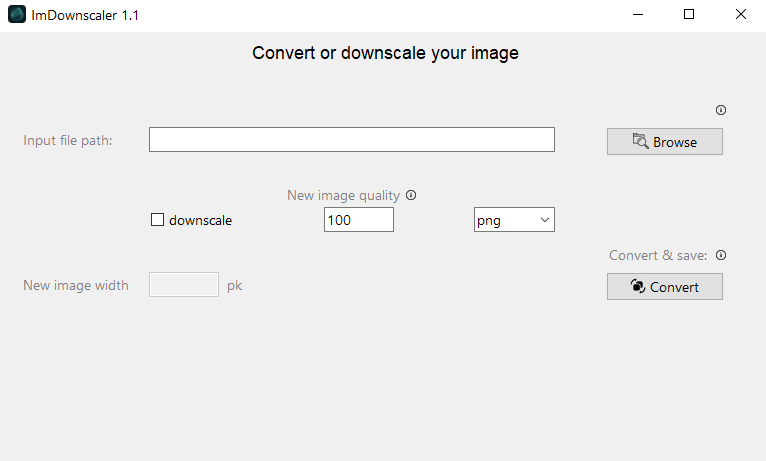

# ImDownscaler

This application allows you to work with image formats and quality.  

After importing an image from your device, you can save it in various formats and adjust its resolution.

To begin, enter the full path of your desired image in the "Input file path" field, or use the "Browse" button to select an image via your file explorer.

Next, you have the option to enable "Downscale." If selected, enter the new desired width for the image in pixels (this should be smaller than the original image's width) in the "New image width" field. If "Downscale" is not chosen, the image will be saved at its original resolution.

For new images being saved in lossy formats (JPEG, JPG, and WebP), you can specify the quality of the converted image in the "New image quality" field (in percentage).

Finally, select the desired output format for your converted image from the dropdown list. PNG is set as the default format.

Now, simply click "Convert," and your image will be processed and saved in the same directory as the original, with "_compressed" appended to its filename.

**The available input image formats:**  

jpg  -  jpeg - jfif - png  
gif  -  bmp  - tif  - tiff  
webp  - ico  - pcx -  ppm  
pgm  -  pbm  - dds  - eps  
psd  -  sgi -  tga  - xbm  
jp2  -  jpx  

**Available saving formats:**  

png  - jpeg - gif  - bmp  
tiff - webp - ico  - pcx  
ppm  - pdf  

**All releases:**  
 

---

---
