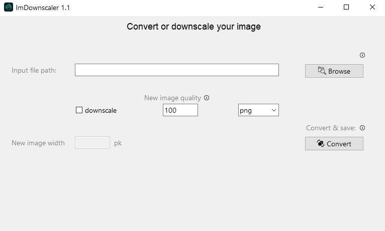

# ImDownscaler v1.2

*This application allows you to work with image formats and quality.*

To start, use the `Browse` button to select your image. You can also select multiple files at once if you want to process a batch.

Next, you have the option to enable `Downscale`.
- If selected, enter the new desired width for the image in pixels (this should be smaller than the original image's width) in the `New image width` field.
- If `Downscale` is not chosen, the image will be saved at its original resolution.

For new images being saved in lossy formats (JPEG, JPG, and WebP), you can specify the quality of the converted image in the `New image quality` field (in percentage).

Finally, select the desired output format for your converted image from the dropdown list. PNG is the default format.

Click `Convert` to process your files. The outputs will be saved in a new `RESULT` folder inside the original image's directory, with "_compressed" appended to the filenames. 
Batch processed images are saved there in the same way.

\>  

---

**The available input image formats:**  

jpg  -  jpeg - jfif - png  
gif  -  bmp  - tif  - tiff  
webp  - ico  - pcx -  ppm  
pgm  -  pbm  - dds  - eps  
psd  -  sgi -  tga  - xbm  
jp2  -  jpx  

**Available saving formats:**  

png  - jpeg - gif  - bmp  
tiff - webp - ico  - pcx  
ppm  - pdf  

---

---
